# Wasla — User Journeys

End-to-end journeys actually found in the Wasla app, represented as Mermaid flowcharts with supporting notes. These show how customers and providers move through the product from first launch to completing their goals.

> Journeys included: Onboarding & sign-in, Location setup, Service discovery, Booking, Booking tracking & cancellation, Communication, Reviews, Loyalty & rewards, Provider onboarding, Provider service management, Provider request handling, Provider wallet, and Provider promotion.

---

## 1. Onboarding & Sign-in

Both customers and providers share the same entry flow, branching by role after verification. Providers complete an extra store setup.

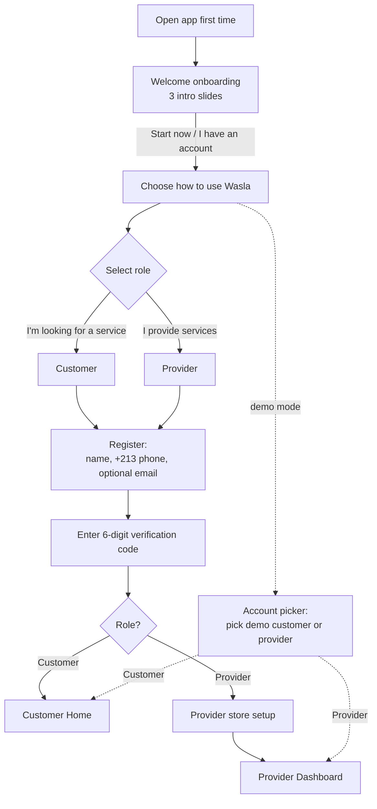

**Notes**
- The welcome onboarding appears only on first launch.
- Social sign-in (Google, Facebook) is offered as an alternative on the registration screen.
- In demo mode, an account picker provides instant access and any six-digit code is accepted.

---

## 2. Location Setup (Customer)

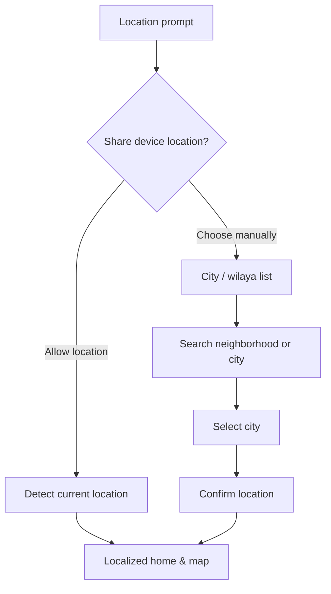

**Notes**
- Location powers "Services near you," distance sorting, and the map.
- Users who decline GPS can still get localized results by picking a city.

---

## 3. Service Discovery (Customer)

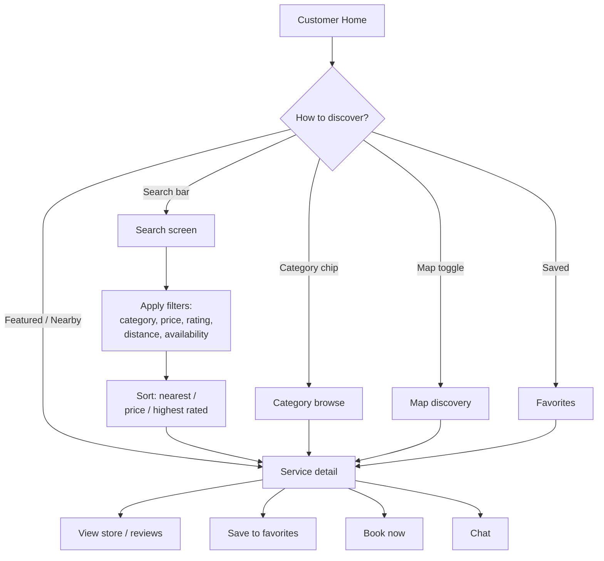

**Notes**
- The home feed, search, category browse, and map all converge on the **Service detail** page.
- From a service, users can branch to the provider's store, save it, chat, or start a booking.

---

## 4. Booking a Service (Customer)

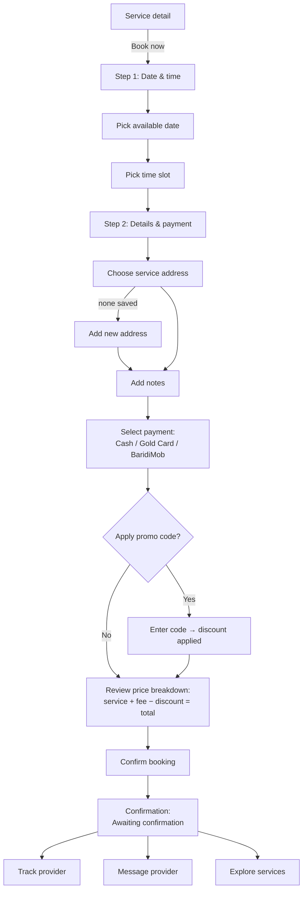

**Notes**
- The price breakdown is always transparent: service cost, platform fee, any discount, grand total.
- After confirming, the booking is **pending** until the provider accepts it.

---

## 5. Booking Tracking & Cancellation (Customer)

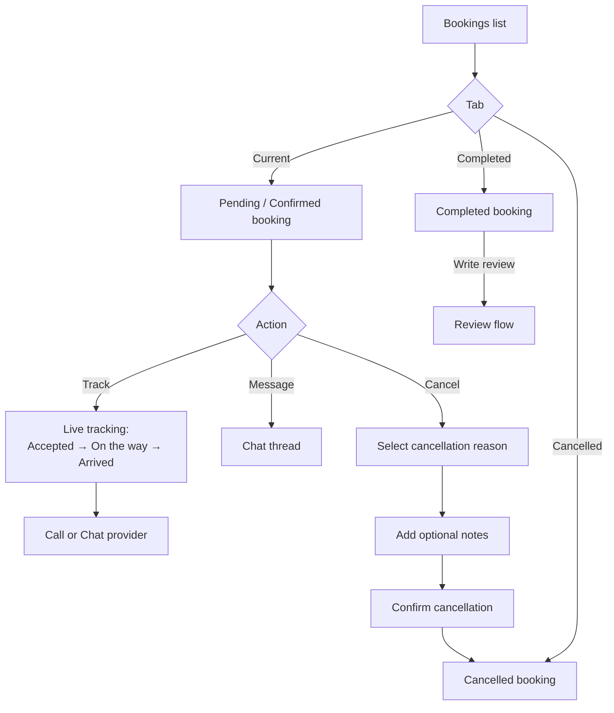

**Notes**
- Booking statuses: **pending → confirmed → completed**, or **cancelled**.
- Tracking offers call and chat shortcuts and a map view of the provider's progress.

---

## 6. Communication (Shared)

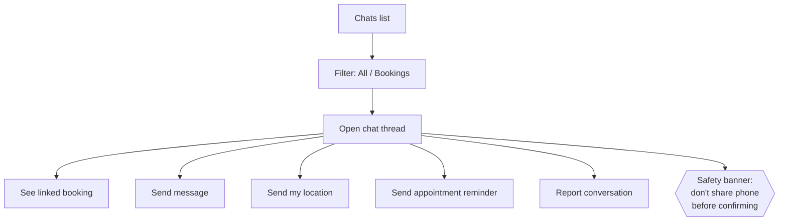

**Notes**
- Messaging is shared by customers and providers; threads are linked to a booking.
- The safety banner is a persistent reminder to keep personal numbers private until confirmation.

---

## 7. Reviews & Loyalty (Customer)

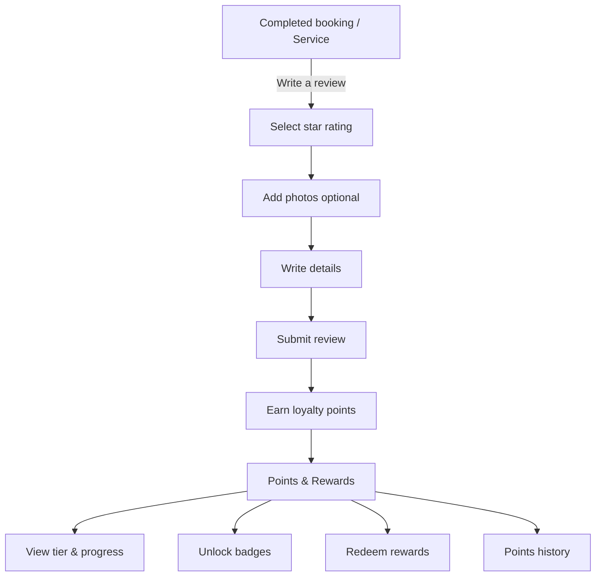

**Notes**
- Reviews feed the engagement loop: actions earn points, which unlock tiers/badges and can be redeemed for rewards.

---

## 8. Provider Onboarding

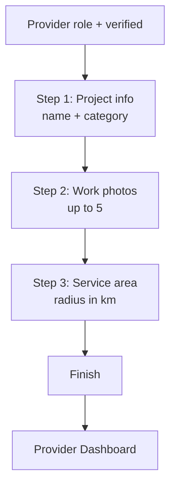

**Notes**
- Store setup is a one-time, guided three-step flow that must be completed before the dashboard.

---

## 9. Provider Service Management

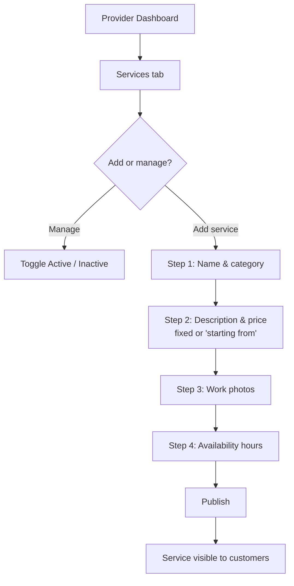

---

## 10. Provider Request Handling

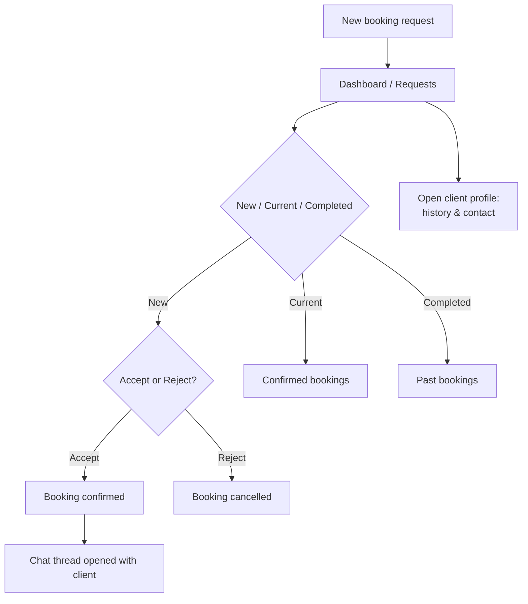

**Notes**
- Accepting a request both **confirms** the booking and **opens a chat** with the client.
- Rejecting **cancels** the request.

---

## 11. Provider Wallet & Promotion

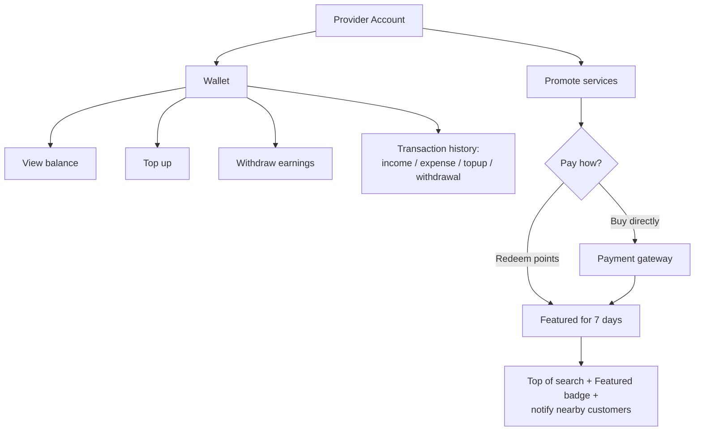

**Notes**
- Promotion can be funded with loyalty points or a direct purchase.
- Wallet centralizes provider finances: earnings, fees, top-ups, and withdrawals.

---

## Journey map at a glance

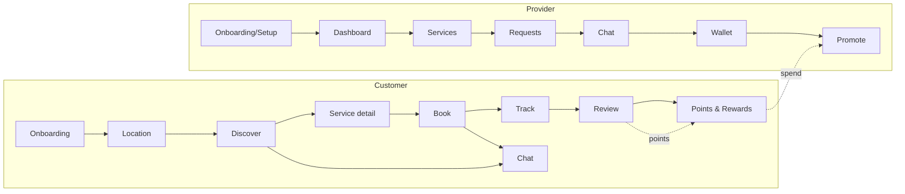

---

See **[USER_GUIDE.md](USER_GUIDE.md)** for step-by-step instructions and **[FEATURES_GUIDE.md](FEATURES_GUIDE.md)** for full feature descriptions.
